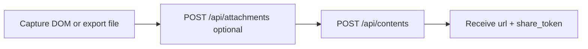

# AI Chat Export API — Programmatic Archive and Share

An **AI chat export API** helps you move conversations out of closed UIs into durable links or archives. **ChatView** focuses on export → share: you supply HTML (and optional files), and the API returns a hosted page URL suitable for teammates or customers.

## Export pipeline



1. **Capture** — extension or script reads HTML + plain text
2. **Upload attachments** (optional) — screenshots, PDFs, markdown exports
3. **Create content** — merge metadata and receive `url`

## SDK: export with attachment

```typescript
import { ChatViewClient } from '@chatview/sdk';
import { readFileSync } from 'node:fs';

const client = new ChatViewClient();
const screenshot = new Blob([readFileSync('screenshot.png')]);

const exported = await client.createContentWithAttachments(
  {
    raw_html: '<p>Full thread with diagram</p>',
    title: 'Exported ChatGPT session',
    source_platform: 'ChatGPT',
    plain_text: 'Thread summary…',
  },
  [screenshot],
);

console.log(exported.url);
```

## Metadata for search inside your org

Use `metadata` for `conversation_id`, `tags`, and `language` so your CMS or support tooling can correlate shares with internal tickets.

## Comparison to vendor export buttons

Vendor UIs rarely offer stable APIs. ChatView standardizes **AI response sharing** across ChatGPT and Claude with one HTTP contract—see [ai-conversation-sharing-api.md](./ai-conversation-sharing-api.md).

## Related resources

- [Upload AI conversation HTML](./upload-ai-conversation-html.md)
- [Browser extension API](./browser-extension-ai-sharing-api.md)
- [https://chat-view.com/docs/api](https://chat-view.com/docs/api)
